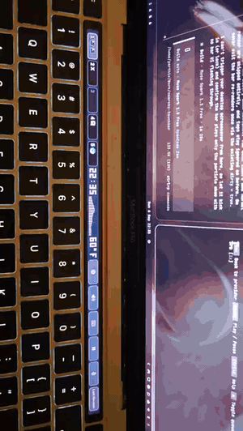

# barmarchy

Native Touch Bar daemon for Omarchy on Apple Silicon Macs — workspaces, app
icons, sliders, F-keys, themes, a pixel pet, and a particle screensaver,
all rendered straight to the bar in Rust. Replaces `tiny-dfr`.



*The bar in action: theme picker + live audio visualizer (tap to cycle styles).
Full-quality clip: [barmarchy-visualizer.mp4](demo/barmarchy-visualizer.mp4).*


## Install (one command)

```bash
curl -fsSL https://raw.githubusercontent.com/ParthivMangukiya/barmarchy/main/install.sh | bash
```

Requirements: Apple Silicon MacBook Pro with Touch Bar running
Asahi/Omarchy (M1 13" J293 verified; M2 13" J493 uses the same panel and is
expected to work — please report). No hardcoded `/dev` nodes: the daemon
probes at startup for the 2008x60 DRM panel, the `* Touch Bar` input, its
live touch ranges, and the `Apple SPI Keyboard`. User must be in the
`video` group (the installer adds you; log out/in once if it did) — that
covers both the DRM panel and the Touch Bar input via
`udev/99-barmarchy-touchbar.rules`, which assigns the `* Touch Bar`
device to `video` (`input` group still works as a fallback;
`uaccess` alone can't cover this panel since it reports
`ID_SEAT=seat-touchbar`, which logind knows no seat for). The installer builds the release binary,
installs `~/.local/bin/omarchy-touchbar`, enables the user service, and
masks stock `tiny-dfr`. Uninstall: `./install.sh --uninstall`.

## What's on the bar

- **Workspaces** — tap to focus, app icons per workspace, accent on active
- **Clock + pixel pet** — a pixel cat that idles, winks, dances, plays ball,
  eats, sleeps, and goes Happy (hearts + blush) when you tap it
- **Weather** — pixel temperature next to brightness, tap to refresh
- **Controls** — display/volume/keyboard sliders, media, mic, all accent
- **Theme button + picker** — follows your Omarchy theme
- **Overlays** — hold `Fn` for F1–F12, `Super+Ctrl` themes, `Super+Shift` apps
- **Screensaver mirror** — while the desktop TTE screensaver runs, the bar
  plays its own 5-effect particle show (assemble, decrypt, rain, beams,
  blackhole), alternating OMARCHY and the clock

## Configure

`~/.config/omarchy-touchbar/config.toml` (auto-created with defaults):

```toml
[bar]
workspaces = 5
show_clock = true
show_weather = true
show_theme = true
menu_expand = true   # false = theme/app menu buttons use the fixed strip width

[deck]
viz_secs = 8.0       # visualizer phase per rotation while playing
marquee_secs = 4.0   # now-playing title phase (0 = title disabled forever)

[[button]]          # slider | media | mic | night | lock | command
id = "volume"
kind = "slider"
target = "volume"

[[app]]             # Super+Shift launcher
id = "yt"
name = "YouTube"
url = "https://youtube.com/"
```

Restart after edits: `systemctl --user restart omarchy-touchbar.service`.

## Center deck plugins

The strip between workspaces and controls is one dynamic zone — the
center deck: `[clock] [pet | levels | pomodoro] [weather]`. The bar only
grants bounds; each plugin owns what and how it draws (`src/deck.rs`:
implement `CenterPlugin`, push it in `registry()`, no bar changes needed).
Clock/weather are small pixel text (~35px). The center slot shows one
plugin by priority: playing-audio levels > active pomodoro > pet. Tap =
that plugin's action (pet, cycle visualizer style, start/pause);
double-tap cycles pinned plugins. Playback is owned by the media
button — tapping the visualizer never plays/pauses. While music plays,
the levels slot rotates between the visualizer and a scrolling
now-playing title (`[deck] viz_secs` / `marquee_secs`).

Apps feed the deck via cache files (bar never captures audio itself):

```bash
# audio visualizer: viz/viz-feed.py captures the default sink monitor
# (pw-record + FFT, 10 bands @ ~10Hz, only while MPRIS is Playing) and
# writes levels.json. Runs as omarchy-touchbar-viz.service:
#   viz/viz-feed.py -> ~/.local/bin/omarchy-touchbar-viz
#   systemctl --user enable --now omarchy-touchbar-viz.service
# manual feed (testing):
printf '%s' '{"levels":[0.9,0.7,0.5],"label":"Spotify"}' \
  > ~/.cache/omarchy-touchbar/deck/levels.json
# pomodoro: timer app writes while a session runs (remove file when done)
printf '%s' '{"active":true,"label":"24:59"}' \
  > ~/.cache/omarchy-touchbar/deck/pomodoro.json
```

Preview offline: `--view levels`, `--view pomodoro`.

Hardware overrides (only needed if probing picks wrong on your model):
`BARMARCHY_DRM=/dev/dri/card1`, `BARMARCHY_TOUCH=/dev/input/event5`,
`BARMARCHY_KBD=/dev/input/event2` — set via
`systemctl --user edit omarchy-touchbar.service` (`[Service] Environment=`).

## Hack on it

```bash
touchtest --live 60   # build + run on hardware (service auto-restores)
touchtest --saver 20  # screensaver preview on the bar
./target/release/omarchy-touchbar --png /tmp/bar.png --view saver:rain:2.2
```

`dev/` has the systemd unit template and service installer.

MIT — vibecoded with Muse Spark.
